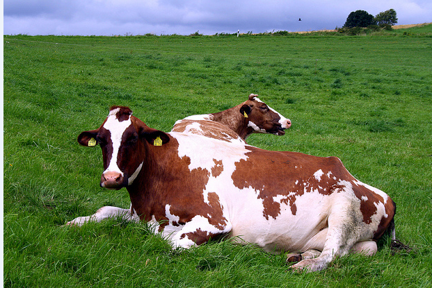
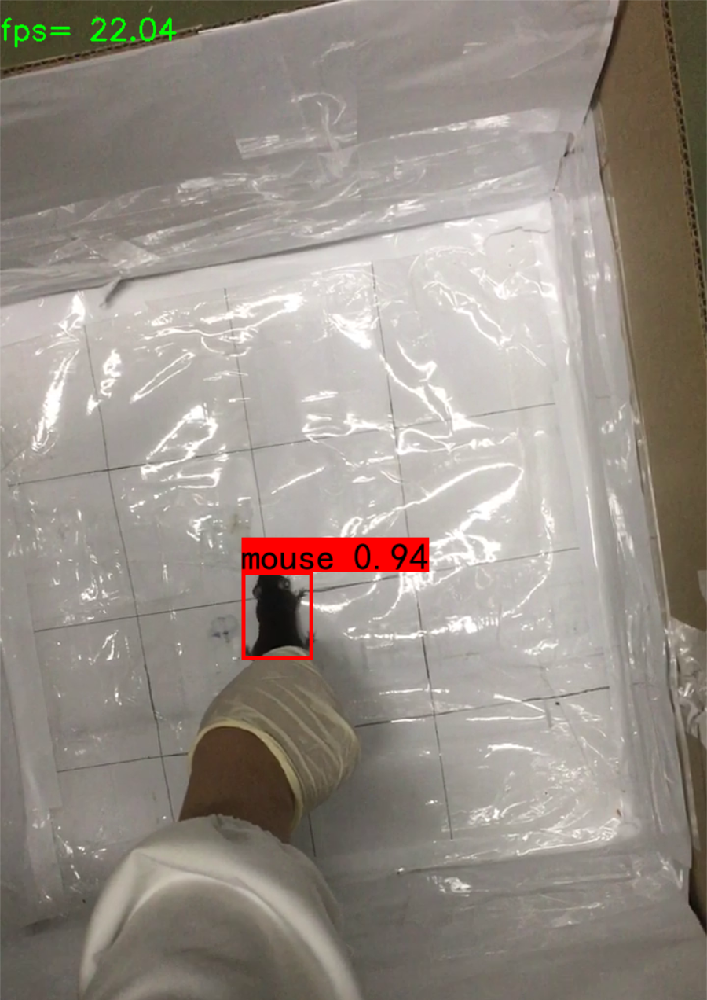
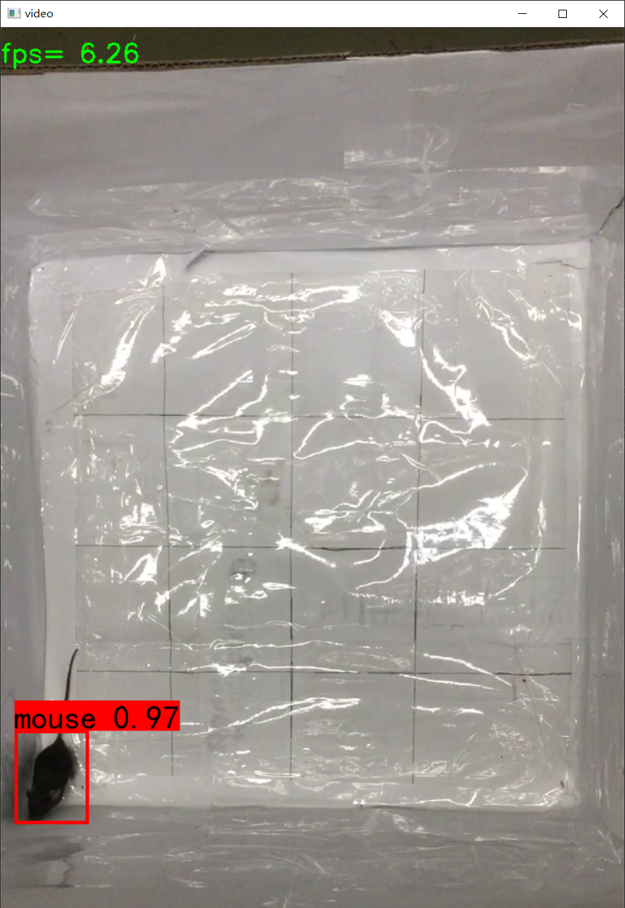
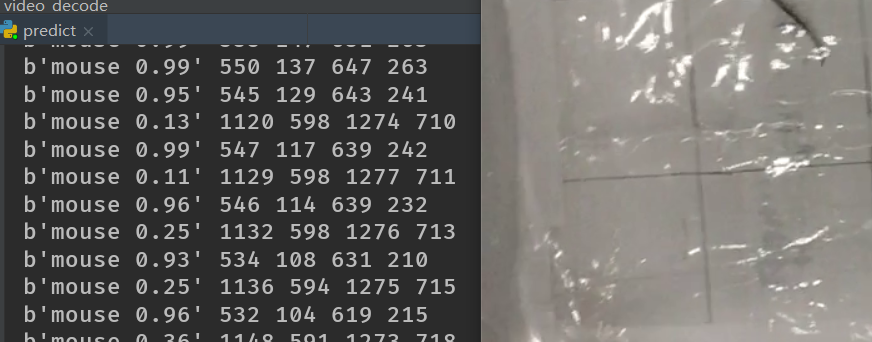
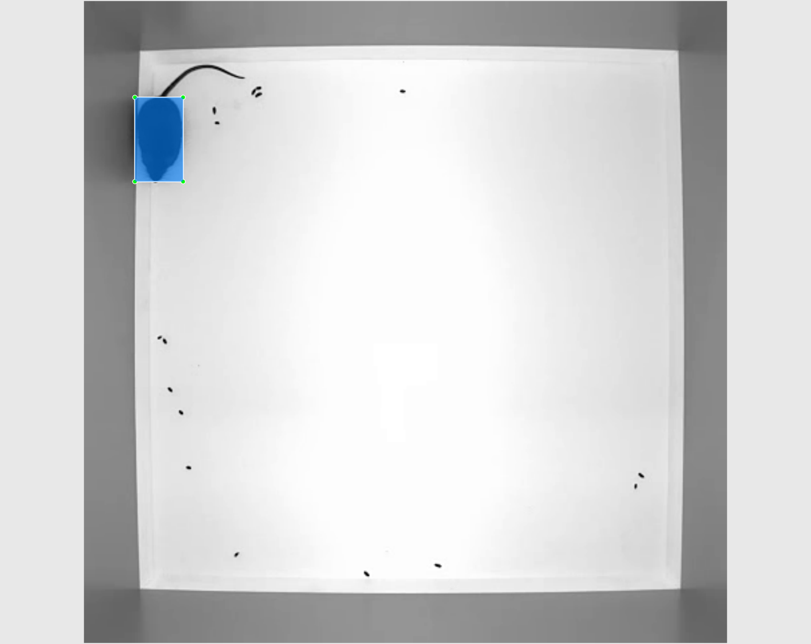

# yolov3老鼠检测

yolov3实现的老鼠位置检测

# 效果展示

# 训练

## 数据集

自己做的数据集,其中大概有800张老鼠的图片,因此此模型应该能检测到大多数的老鼠

## 缺陷

由于分类只有一类,因此似乎各种外部的因素,都可能会被网络区分为老鼠,因此需要增加数据集容量,增加更多负样本,增加网络泛化能力

# 修改记录

输入图片大小w\*h:720\*1280,iPhone手机拍摄视频

## 2022.03.02

使用最开始的yolov3(darknet53主干),其他原封不动

使用cpu,fps只有可怜的2.模型大小240m

使用rtx3060 cuda,fps基本达到21

## 2022.03.04

增加负样本数据集,增加很多类似这种未标注的图像,设置目标个数为0.相当于告诉网络其他乱七八糟的不是mouse目标

效果

## 2020.03.06

backbone部分使用ghost网络,并且使用华为在github上开源的权重,在ImageNet上准确率约为73.

可以看到cpu跑fps由**2->6**!并且模型大小由原先**240m->90m**,准确率变化也不大

训练60epoch后,效果挺好,但是还是会有某些误判.如下置信度较小0.1-0.2左右的框框,极大的可能原因是原素材较少.

我使用了200张实地场景俯视图+700张各种老鼠各种角度+200张背景组合成的训练集测试的

## 2020.03.08

使用shufflenetv2x1做backbone训练了将近100个epoch,发现损失一直在7附近难以下降

我没有找到shufflenetv2x2的预训练权重,网络channel通道多一些可能效果好一些

尝试使用降低batch大小和降低lr的方法来继续训练模型,发现有一定的效果,但是收效甚微,例如损失可以由7.2降到6.8.而且接着训练十分容易过拟合(train loss 减小 val loss基本不变).

似乎shufflenetv2x1做backbone的效果不如ghostnet

ghostnet训练30个epoch基本损失就降到3了,不过也是因为当时用的是416x416的的输入图片,这次使用shufflenet用的是608x608的输入图片

## 2020.03.09

昨天发现很多的晚上下的数据集,很多老鼠700多张的数据集有问题,很多数据集处理的很差劲,杂乱,甚至有的都没有标注,于是决定自己来标注数据集.

从外网[网址](https://www.kumarlab.org/2019/02/12/single-mouse-tracking-annotated-dataset/)这上面下了个老鼠检测的数据集,虽然不是很相似,但是可以拿来做标注数据,其中图片类似这样

今晚标注了将近400张,总的数据集大概有700张.真的累人,训练明天再训练了

# 致谢

主体yolo部分代码参考

* https://github.com/bubbliiiing/yolo3-pytorch

